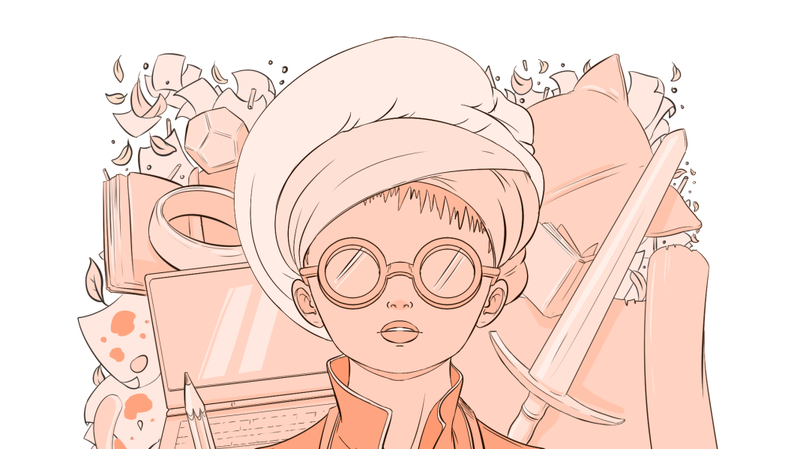

<picture>
 <source media="(prefers-color-scheme: dark)" srcset="testa2.png">
 <source media="(prefers-color-scheme: light)" srcset="testa2.png">
 
</picture>

---

### Hi, I'm Barb! 👋
I'm a **React developer** and an **illustrator**.  
*How and why did you start programming?* you may ask. Good question.  
Well, in the beginning it wasn't something I took too seriously. I learned C# and Unity because some friends needed a programmer for a game. But then I realized, *Hey! I'm actually good at it. Let's take it to the next level*.  
So I started to study Js and all the regular front-end stuff, with the goal of becoming skilled enough to build useful apps initially for myself and then for the rest of the world.  
And now here I am, arranging hooks and effects to create wonders!  

The biggest project I'm working on at the moment is a **DM Digital Screen** for Pathfinder 2nd edition. If you're interested in contributing DB building, please do not hesitate to contact me!

#### Languages currently known: React/Preact, JS, HTML/CSS (w/Tailwind), C#
#### Technologies currently used: VSC, Clip Studio Paint, Adobe Creative Suite (Photoshop, Illustrator, InDesign), Blender, Unity. All my projects are deployed with Netlify.
